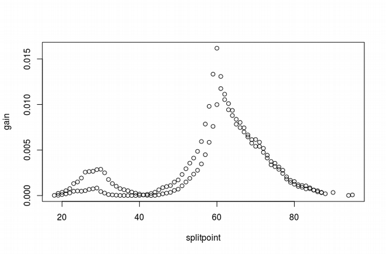
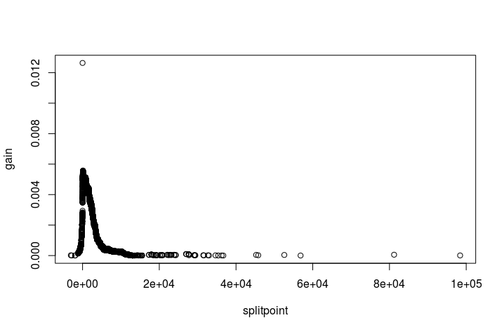
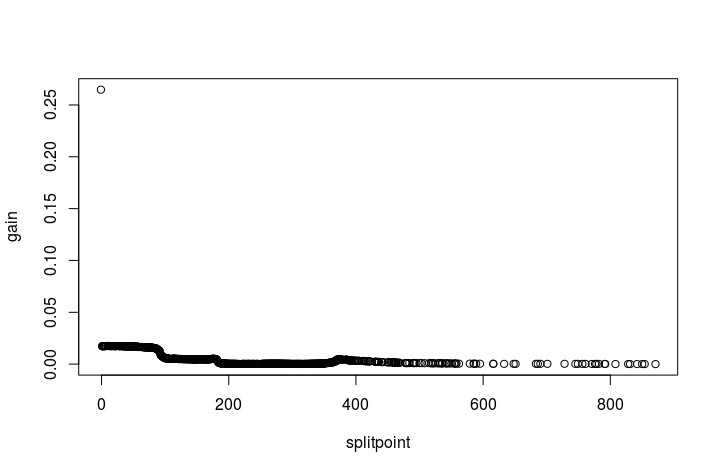
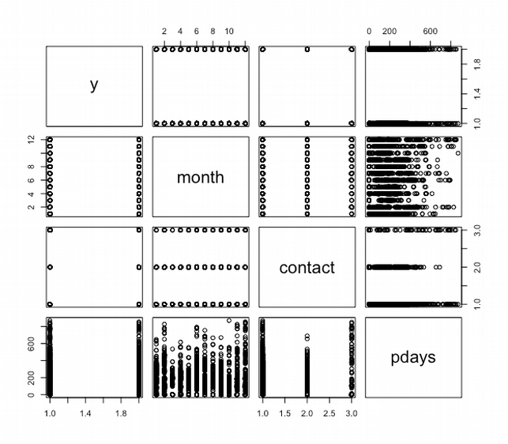
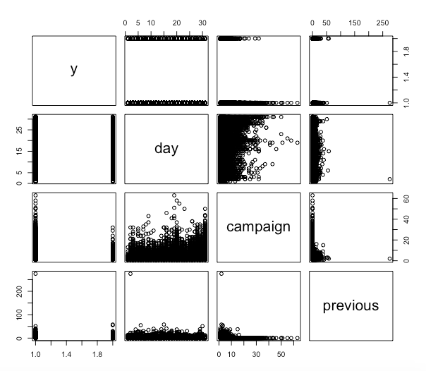
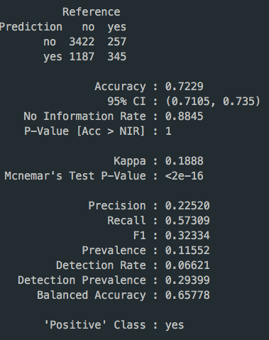
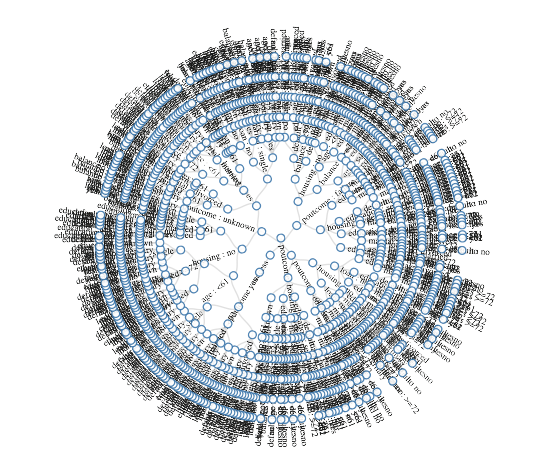
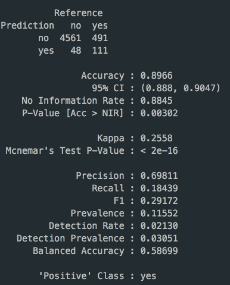
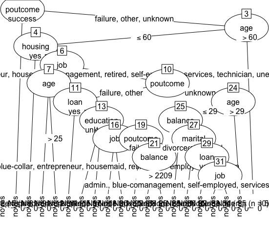

**Bank-Marketing-by-Decision-Tree**

Author:Jie Tao, Joel Smith

**Approach, Problems Encountered, and Packages Used**

 The code was written in R and the caret package was used to help with cross validation, ggplot2 was used for plotting the errors, ROSE was used to balance samples, and data.tree was used for building the tree structure.

The bank marketing dataset from the UCI website was analyzed. This dataset deals with direct call marketing campaigns of a Portuguese bank, with a classification goal of predicting whether the client will subscribe a term deposit. There are 45,211 observations and 21 features, including the target. Ten of the features are categorical, leaving ten as numeric, and the target is a binary categorical feature taking on the values &quot;yes&quot; and &quot;no.&quot; We kept 40,000 samples for training and 10-fold cross validation, and 5,211 samples for testing. The 40,000 training samples are processed by ROSE to achieve a 1:1 ratio of positive vs negative classification. We used ROSE because we initially had issues with the tree wanting to simply predict the most frequent class.

|   | Training | Testing |
| --- | --- | --- |
| amount | 40,000 | 5,211 |
| ratio | Yes:No[1:1] | Yes:No[1:10] |

As for creating bins to sort the continuous variables, we wrote a function, _binconti,_ to find the boundaries by calculating information gain for each point. Then we created a scatter plot to determine the possible best boundary. The plots are shown in Figures 1, 2, and 3 for features age, balance, and pdays, respectively.

 

Figure 1. Age 30 and age 60 are possible split points.

 

Figure 2. Balance = 72 is a good split point.

 

Figure 3. No significant information gain by pdays.

We utilized pre-pruning in the construction the tree. Two parameters were used: node sample threshold and node purity threshold. If the number of samples in a node are less than the sample threshold or node purity higher than the purity threshold, the majority class will be set as the leaf. Error rates for given values of node sample threshold and purity threshold are discussed further and shown in Table 1 in the next section.

We created a tree with all variables included, but the printout of the tree became very difficult to read. Thus, correlation matrices were created between variables in order to determine which variables could be dropped. This was done with the understanding that the model would be able to determine relationships between variables that we cannot see in these plots. This was just an effort to increase simplicity in the final tree. Month, contact, and pdays are categorical variables, and the response variable, y, seems to be equally distributed amongst the levels of each variable. Campaign, previous, and pdays appear to have some relationship with y, but the correlation coefficients between the variable and y are -0.07, 0.09, and 0.10, respectively. Since these correlations are quite low, we have decided that these variables are acceptable to remove. The correlation matrices can be seen in Figures 4 and 5.

 

Figure 4. Correlation matrix including the variables y, month, contact, and pdays.

 

Figure 5. Correlation matrix including the variables y, day, campaign, and previous.

One error encountered came while plotting the tree. For some reason, the nodes after the initial root node are displayed as the level the node takes on. So, if the next node to be split on was &quot;job,&quot; the printed nodes would read &quot;admin.,&quot; &quot;blue-collar,&quot; &quot;entrepreneur,&quot; etc. Although confusing, this is not a huge issue, as the levels of most features are distinct and we are able to determine which variable is the node based on that fact. Or, the tree could be printed in the R console and the features are listed there.

**Demonstrate effectiveness of classifier**

** The effectiveness of the tree was dependent on the size of the variable threshold.sample, which is the minimum number of observations required in a node in order to split that node. With a training set of 40,000 observations, we varied this number in differing increments from 10 to 5,000. The cross validation error rate generally increased as the node sample threshold increased, while it essentially did not change for varying levels of purity threshold. A higher node sample threshold yields a more overfit tree. The error rates can be seen in Table 1.

 Similar to the cross validation error rate, the F1 score decreased as the node sample threshold increased. The F1 score remained relatively unchanged as the purity threshold increased. The F1 scores can be seen in Table 2.

Table 1. Error rate of cross validation according to node sample threshold and purity threshold.

| Error rate | **Purity Threshold** |
| --- | --- |
| **Node Sample Threshold** | **0.7** | **0.8** | **0.9** | **0.95** |
| **10** | 0.301000 | 0.291600 | 0.29145 | 0.29175 |
| **100** | 0.317700 | 0.314925 | 0.315025 | 0.315050 |
| **500** | 0.330600 | 0.330100 | 0.330175 | 0.330175 |
| **1000** | 0.336500 | 0.336525 | 0.336525 | 0.336525 |
| **5000** | 0.365525 | 0.365600 | 0.365600 | 0.365600 |

Table 2. F1 Score of cross validation according to node sample threshold and purity threshold.

| F1 Score | **Purity Threshold** |
| --- | --- |
| **Node Sample Threshold** | **0.7** | **0.8** | **0.9** | **0.95** |
| **10** | 0.667252 | 0.677189 | 0.678591 | 0.678721 |
| **100** | 0.65149 | 0.655266 | 0.655172 | 0.654971 |
| **500** | 0.63155 | 0.632649 | 0.632649 | 0.632649 |
| **1000** | 0.609271 | 0.609813 | 0.609813 | 0.609813 |
| **5000** | 0.618286 | 0.618291 | 0.618291 | 0.618291 |

 We picked a value for node sample threshold = 10 and purity = 0.95 as the best parameters to build the tree. After validated by the test samples, which used the imbalanced structure as the raw data, this ID3 decision tree was 72.29% accurate and obtained an F1 score of 0.32. The major problem was too many false positives. A possible solution is to build another tree to handle the result of the first tree which extracts the features figuring out true positives from (TP+FP).

 

**Diagram of the Decision Tree**

Figure 5 and Figure 6 shows the tree created with the smallest error. The value for threshold.sample was 10 with purity 0.95. An interesting point is that while this tree had a smaller error, the tree is much more complex looking. Therefore, it loses a bit of interpretation at the level of visualization.

 

Figure 5. Part of the tree structure.

 

Figure 6. Radial network of the tree structure.

**Discussion/analysis of results**

 In our first attempt, using the tree constructed with a threshold.value of 10 node samples and 0.95 purity shows that the feature with the highest information gain is duration, which is the duration of the previous call with the client. The authors state that this variable has a high correlation with the target. They mention that this input should only be included for benchmark purposes and should be discarded if the intention is to have a realistic predictive model.

 So, the root of our tree changed to variable &quot;poutcome.&quot; This is the outcome of the previous marketing campaign, including levels of &quot;failure,&quot; &quot;success,&quot; &quot;nonexistent,&quot; and &quot;unknown.&quot; Logically, this makes sense. If the previous call did result in the client subscribe a term deposit, then it is likely that the same decision will be made. The opposite case is true as well.

 For the failure level of poutcome, the tree branches to housing, if customer without a housing loan, average yearly balance of less than 72, with primary education and age older than 61 years, there is a higher probability of a success. Otherwise, if age is less than 61, there is less chance of a success. We can guess some of the target customers in this marketing campaign are low-income elders without housing loans.

 Since the target variable is primarily a response of no, a path leading to a yes is what the bank should focus on. The most general path to a yes is if the previous outcome was a success, or classified as other. Banks should focus on previous clients that subscribed to a bank term deposit. However, even when the previous outcome was a failure, some clients went with the bank term deposit later. Specifically, those without a housing loan. Those with a housing loan and an education level of tertiary were classified as a yes. While this decision tree is not an absolute answer, it can help guide the bank to make better use of their time by focusing their calls to the clients that are more likely to say yes.

**Appendix I - Random Forest**

 We constructed a random forest with some training and test data for reference, which attained 89% accuracy and an F1 score of 0.29. Since it has a low recall value, the random forest reduces false positives significantly, but increases false negatives. In the real world, it is likely more useful as a cost saving measure.

 

**Appendix II - C5.0 Tree**

We tried to use C5.0 to build a tree. The result seems easier to understand. But we find the way of splitting is different from ID3.

 

